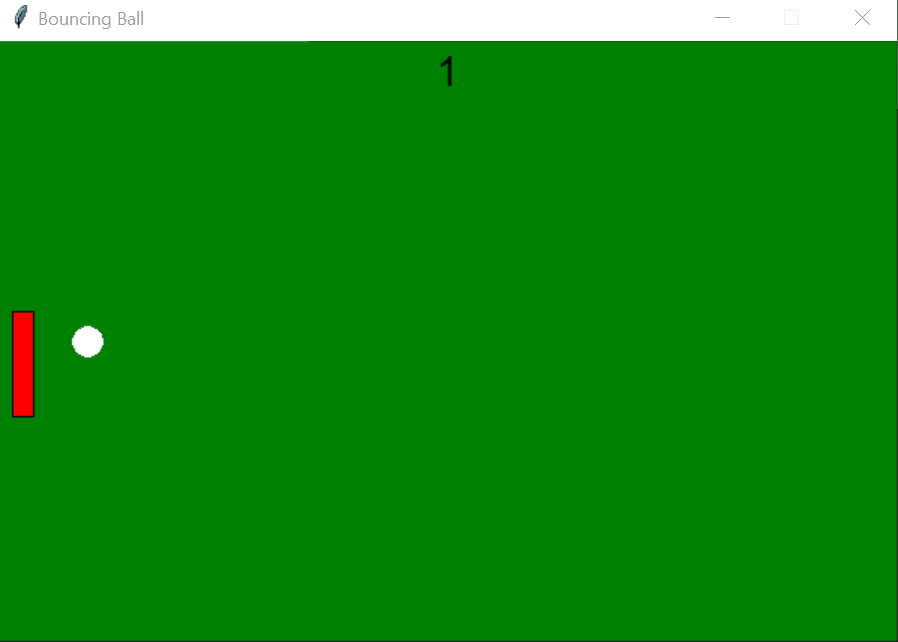

# Basic Pong Game

This was one of the first projects that I did within python, and is a simple pong-esque movement of a ball and a rectangle with a counter for hits.

While it is not in a state to be called a game, as there are many things that have to be fixed and many areas that could be improved upon, it helped put together many of the
fundamentals of programming in a visual way, rather than just text on a screen. It also helped emphasize the difficulty in getting real-time data from a user, and the
precautions one should take when using that data, as it is limited by the speed of the program and cannot always replicate what is actually happening.

This program was completed using Python 2.7.9 using the tkinter library.
 
 

  
       
      Basic Pong Game GIF

