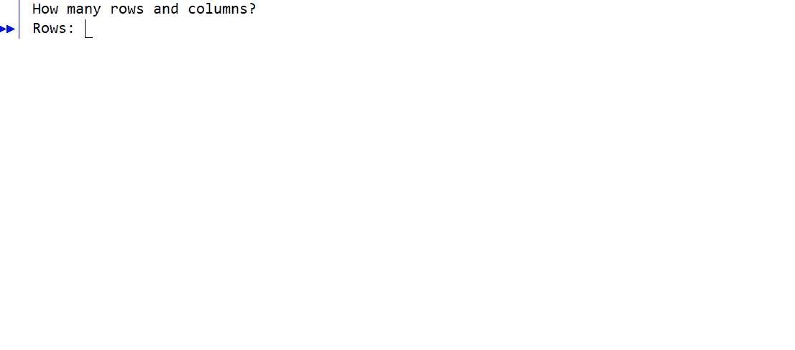

# Gaussian Elimination

This program utilizes a Brute-force approach to Gaussian Elimination in solving a M x N matrix of linear equations. It also allows for the user to manipulate the matrix manually,
by swapping rows, adding two rows together, or multiplying two rows by a constant. However, the only main operation in the instructions is to solve the inputted matrix, which 
utilizes the three operations mentioned to maniputlate the matrix and eliminate both upper and lower triangles.

The project helped develop a more in-depth understanding of matrices, and the complexities that arise when trying to automate the seemingly simple operations that can be used on
them. It also brought to the fore the problem of floating point error in division and multiplcaiton. Also, it helped introduce me to more of the concepts of JAVA, especially
debugging techniques, as it is one of my earlier projects done in this language.

This project was completed using jGRASP, and the GIF below shows a simple running of the program: inputting a pre-determined matrix and then solving for the the coefficients a,
b, and c.

 
 

  
       
      Gaussian Elimination GIF

