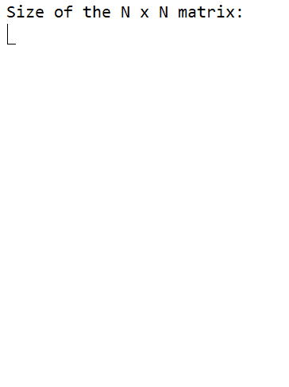

# Magic Squares

This program calculates the solutions to all magic squares of a given size. Magic squares consist of a N x N matrix with all columns, rows, and diagonals adding 
to the same value. The output is a simple matrix representation of each solution found, with the time (in seconds) the program took in finding it.

This project helped demonstrate the size of an N-factorial complexity, as it relies on generating all the permuatations of a matrix. The only feasible size, given the
average computer, for this program to run is a 3x3 matrix. The advantage, of course, is to be able to get all solutions to the problem as opposed to alternate methods
which rely on a specific formula to find one specific solution. As opposed to the WordFind project, this program demonstrates how a Brute Force algorithm can become almost
useless quite fast with more complex problems.

This program was done using jGRASP, and the GIF below represents a simple running of this program with each collection of numbers representing an N x N solution to the problem.

 
 

  
       
      Magic Square GIF

