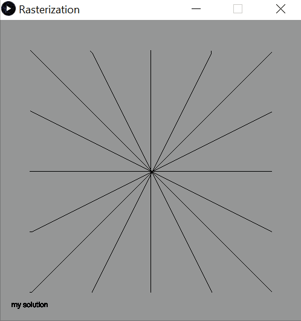

This project focused on rasterizing lines and triangles. The algorithm used for lines was the Midpoint Algorithm, while the method used for filling a triangle
is the Barycentric Algorithm.

This project helped improve my understanding of debugging graphical programs, as well as getting a better understanding of the methods used in common graphical
applications and the complications that exist when presented with such a seemingly simple problem.

The web application of this program can be found at the link: https://jtkitchen.github.io/Projects/basicRasterizationPage/rasterization.html
 

