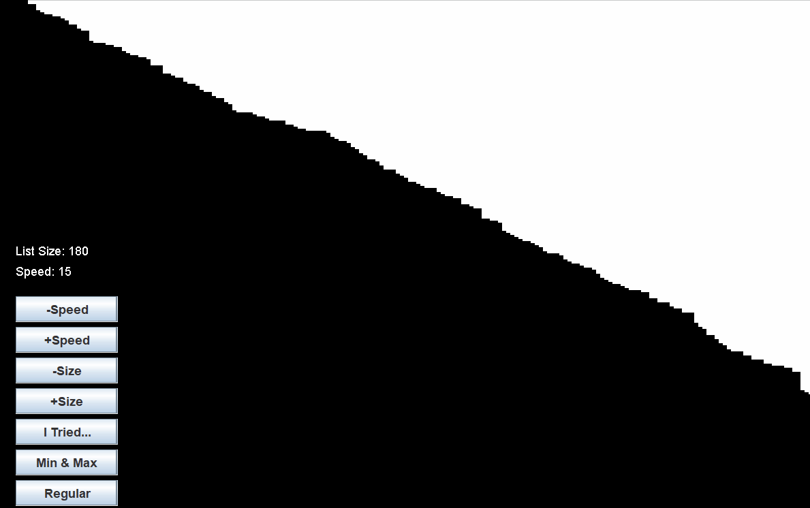

# Selection Sort

This was an extension to the basic Seleciton Sort sorting algorithm, in which I implemented and did rudimentary testing on several variations of the sort. The first
method done was to keep track of both a minimum and a maximum each iteration, and the second method was attempting to keep track of 2 minimums and 2 maximums, if possible,
on each iteration.

This project helped demonstrate the unexpected complications that can arise from a simple idea, namely in imiplementing multiple minimums and maximums. While it seems to
speed up the sorting algorithm as it checks more itmes on each pass, as the sample size grows larger it slows down considerably due to the extra logic. Nonetheless, it was
an interesting proejct to work on, and many things could be improved if I had to revisit the idea again.

The project was completed using JGrasp, and the GIF below represents a simple running of the program sorting a random array of integer values.

  
       
      Selection Sort GIF

