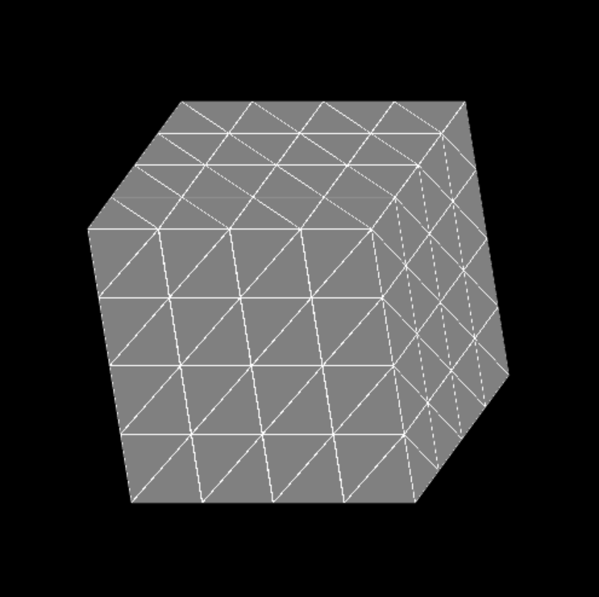

This project consisted of iteratively tesselating several objects: a cube, cylinder, cone, and sphere. The structure of the code was given by the teacher,
mainly the html webpage and the OpenGL code, with the implementation of the tesselation as the project.

This has helped me comprehend a little of what goes on in more intensive graphics, namely the computation needed for even the simplest of shapes. It has also
helped me develop some understanding of, and practice in, JavaScript, as I have not previously done any intensive work within that platform.

The following GIF shows a basic demonstration of the code. However, you can also follow this link to try this out yourself within your web browser:
      https://jtkitchen.github.io/Projects/tesselation/tessellation.html

 
 
 
 

