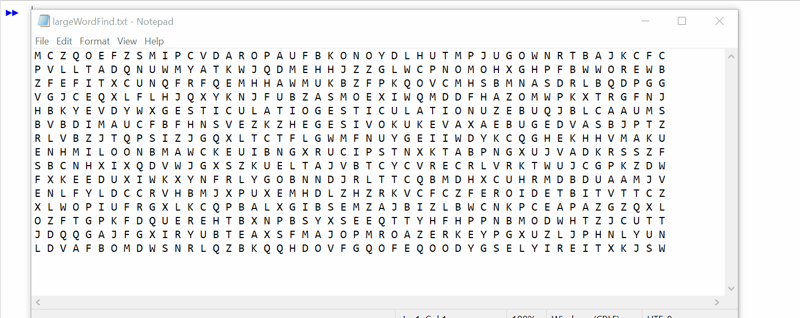

# Word Search Puzzle

This project takes a word search puzzle, represented as a Text file of (m x n) letters, and finds any occurrences of specified Strings. At the moment, it merely gives
a (X, Y) reference to the word's location.

Solving this problem has been a good demonstration of what cases Brute Force approaches are practical. While there were several options for finding a substring of characters
within the puzzle, such as Horspool's Algorithm, most practical cases of these puzzles would not warrant the efficiency gained by such an improvement. Checking one-by-one was
thus an acceptable loss, and helped simplify the representation of characters within the program.

This program was completed using jGRASP. The GIF below shows a simple running of the code, though the final image of the outlined values was merely for visual demonstration and
is not an output of the program itself.

  
       
      Word Find GIF

