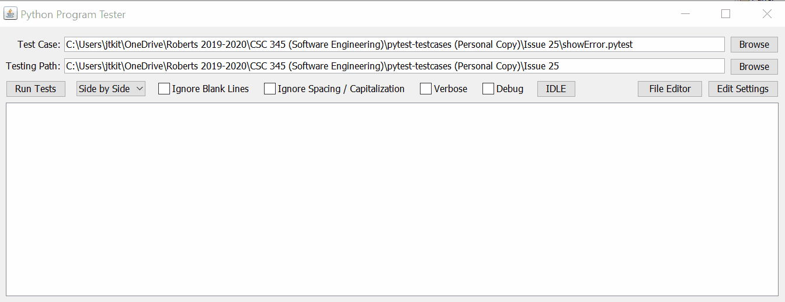

# Python Program Tester
## CSC 345 - Software Engineering - Spring 2015

This project was a joint effort of my class. The project itself was started in 2015 by a previous set of students, and we were tasked to fix some of the bugs that our teacher
had been finding in using it as well as implement some new, useful functionality. The premise of the program is to automate the testing of "copy and paste" python programs
for basic python classes- where the output is explicit and/or constant in the instructions. The program uses a custom file extension, formatted in an XML fashion, as the
template to compare with, runs each python program associated within that template, and then compares the output of the python program to the expected output of the template.
The GUI allows for several customizations in error-checking, but the most common is ignoring general spelling mistakes, such as capitalization errors or missing/blank lines.

This project helped me develop a sense of scale of projects when the task is larger than a simple concept. The importance of good habits, such as useful comments, constant 
commits to a version control system, and general communication between the leader and team members, was evident when they were missing. Even though this is a relatively small
project, having someone person hacking together a temporary fix without any references or explanations can cause long delays in trying to figure out what they did in the future.

This program was completed in NetBeans, and the GIF below shows a very brief use of this program: a sample .pytest Text file used as the template, a run of the test and the
list of results, and the two python programs that were being run a compared to in the template.

 
 

  
       
      Python Program Tester GIF

